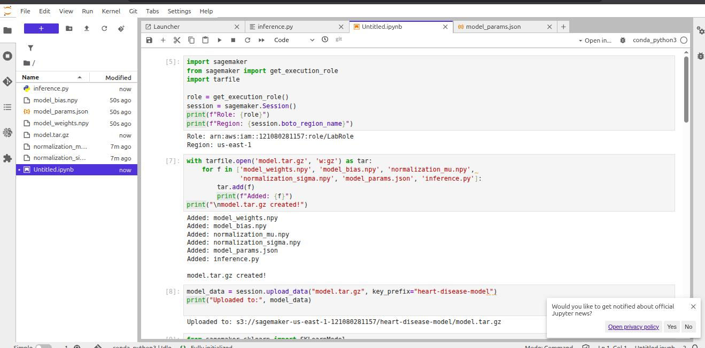
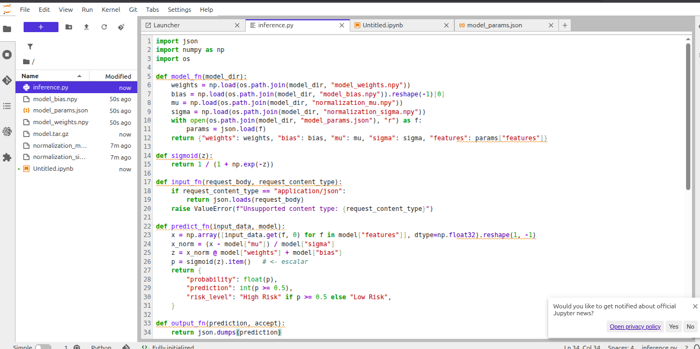
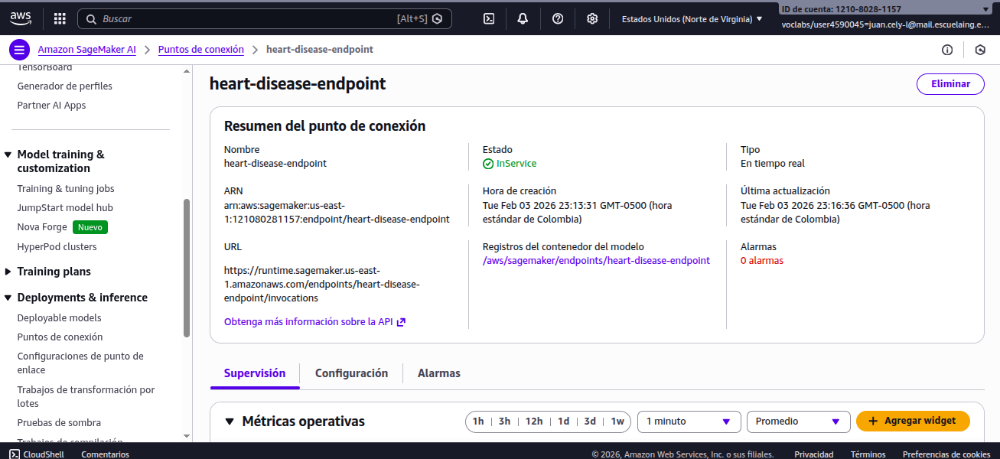

# Heart Disease Risk Prediction

A complete implementation of Logistic Regression from scratch using NumPy for predicting heart disease presence based on clinical features.

---

## Table of Contents

- [Project Overview](#project-overview)
- [Dataset Description](#dataset-description)
- [Project Structure](#project-structure)
- [Implementation Details](#implementation-details)
- [Step 5: Amazon SageMaker Deployment](#step-5-amazon-sagemaker-deployment)
- [Results Summary](#results-summary)
- [How to Run](#how-to-run)
- [Requirements](#requirements)
- [Author](#author)

---

## Project Overview

Heart disease is the world's leading cause of death, claiming approximately 18 million lives each year according to the World Health Organization. This project implements a complete machine learning pipeline for heart disease prediction using only NumPy, Pandas, and Matplotlib (no scikit-learn for core training).

**Key Features:**
- Logistic Regression implemented from scratch
- Comprehensive Exploratory Data Analysis (EDA)
- Decision boundary visualization for multiple feature pairs
- L2 Regularization with hyperparameter tuning
- Model evaluation with multiple metrics

---

## Dataset Description

**Source:** [Kaggle - Heart Disease Prediction Dataset](https://www.kaggle.com/datasets/neurocipher/heartdisease)

The dataset contains 270 patient records with 14 clinical attributes used to predict the presence or absence of heart disease.

### Feature Dictionary

| Feature | Description |
|---------|-------------|
| Age | Age of the patient (years) |
| Sex | Gender (1 = Male, 0 = Female) |
| Chest pain type | 1 = Typical angina, 2 = Atypical angina, 3 = Non-anginal pain, 4 = Asymptomatic |
| BP | Resting blood pressure (mm Hg) |
| Cholesterol | Serum cholesterol level (mg/dL) |
| FBS over 120 | Fasting blood sugar > 120 mg/dL (1 = True, 0 = False) |
| EKG results | 0 = Normal, 1 = ST-T abnormality, 2 = Left ventricular hypertrophy |
| Max HR | Maximum heart rate achieved |
| Exercise angina | Exercise-induced angina (1 = Yes, 0 = No) |
| ST depression | ST depression induced by exercise relative to rest |
| Slope of ST | Slope of the peak exercise ST segment |
| Number of vessels fluro | Major vessels (0-3) colored by fluoroscopy |
| Thallium | Thallium stress test result |
| Heart Disease | Target: Presence / Absence |

### Dataset Statistics

- **Total samples:** 270
- **Class distribution:** 55.6% No Disease / 44.4% Disease (balanced)
- **Missing values:** None
- **Train/Test split:** 70/30 (stratified)

---

## Project Structure

```
Heart-Disease-Risk-Prediction/
|-- heart_disease_lr_analysis.ipynb    # Main Jupyter notebook with full analysis
|-- Heart_Disease_Prediction.csv       # Dataset file
|-- README.md                          # Project documentation
|-- ASSETS/                            # SageMaker deployment evidence images
|   |-- IMAGE1.jpeg
|   |-- imagen2.png
|   |-- imagen3.png
|   |-- imagen4.png
|   |-- imagen5.png
|   |-- imagen6.png
|-- model_params.json                  # Exported model configuration
|-- model_weights.npy                  # Exported model weights
|-- model_bias.npy                     # Exported model bias
|-- normalization_mu.npy               # Z-score mean values
|-- normalization_sigma.npy            # Z-score standard deviation
|-- .gitignore                         # Git ignore file
```

---

## Implementation Details

### Step 1: Data Loading and Preparation

- Loaded dataset from CSV file
- Binarized target column (Presence = 1, Absence = 0)
- Performed comprehensive EDA including:
  - Distribution analysis of numerical features
  - Correlation matrix visualization
  - Outlier detection with boxplots
  - Class balance verification
- Applied 70/30 stratified train/test split
- Z-score normalization using training set statistics

**Selected Features (6):** Thallium, Number of vessels fluro, Chest pain type, Exercise angina, Sex, Age

### Step 2: Basic Logistic Regression

Implemented from scratch:

- **Sigmoid function:** Maps linear output to probability [0,1]
- **Cost function:** Binary cross-entropy loss
- **Gradient descent:** Iterative optimization with configurable learning rate

**Training Configuration:**
- Learning rate (alpha): 0.01
- Iterations: 2000
- Initial weights: zeros

**Model Performance (Unregularized):**

| Metric | Train | Test |
|--------|-------|------|
| Accuracy | 81.48% | 88.89% |
| Precision | 81.82% | 90.91% |
| Recall | 75.00% | 83.33% |
| F1-Score | 78.26% | 86.96% |

### Step 3: Decision Boundary Visualization

Trained separate 2D models for 4 feature pairs:

1. **Thallium vs Number of vessels fluro** - Train Accuracy: 76.7%
2. **Thallium vs Age** - Train Accuracy: 75.7%
3. **Chest pain type vs Age** - Train Accuracy: 70.9%
4. **Number of vessels fluro vs Age** - Train Accuracy: 71.4%

Each visualization includes:
- Decision boundary line (threshold = 0.5)
- Color-coded decision regions
- Scatter plot with true class labels

### Step 4: L2 Regularization

**Regularized Cost Function:**

```
J_reg = J + (lambda / 2m) * ||w||^2
```

**Gradient Update:**

```
dw += (lambda / m) * w
```

**Hyperparameter Tuning Results:**

| Lambda | Train Acc | Test Acc | Weight Norm | Norm Reduction |
|--------|-----------|----------|-------------|----------------|
| 0 | 81.48% | 88.89% | 1.4989 | 0.0% |
| 0.001 | 81.48% | 88.89% | 1.4988 | 0.0% |
| 0.01 | 81.48% | 88.89% | 1.4982 | 0.0% |
| 0.1 | 81.48% | 88.89% | 1.4920 | 0.5% |
| 1 | 82.01% | 88.89% | 1.4355 | 4.2% |

**Key Findings:**
- Test accuracy remains stable at 88.89% across all lambda values
- Weight norm decreases monotonically with increasing regularization
- For this dataset, lambda between 0.01 and 0.1 provides good balance
- No significant overfitting detected (test accuracy >= train accuracy)

### Step 5: Amazon SageMaker Deployment

The best model was exported and deployed to Amazon SageMaker for real-time inference.

#### 5.1 Model Export

Exported model artifacts as NumPy arrays:

| File | Description |
|------|-------------|
| `model_weights.npy` | Feature weights (6 values) |
| `model_bias.npy` | Bias term |
| `model_params.json` | Complete model configuration |
| `normalization_mu.npy` | Z-score mean values |
| `normalization_sigma.npy` | Z-score standard deviation |

#### 5.2 Inference Handler

Created `inference.py` implementing the SageMaker inference protocol:

```python
def model_fn(model_dir):      # Load model artifacts from S3
def input_fn(request_body):   # Parse JSON input
def predict_fn(input_data):   # Generate predictions using sigmoid
def output_fn(prediction):    # Format JSON response
```

#### 5.3 Deployment Process

1. **Created SageMaker Notebook Instance** (ml.t3.medium)
2. **Packaged Model Artifacts** into `model.tar.gz`
3. **Uploaded to S3** bucket
4. **Deployed SKLearnModel** to endpoint (ml.m5.large)

#### 5.4 Deployment Evidence

**SageMaker Notebook Instance Creation:**



**Model Packaging and S3 Upload:**


**Model Training and Export in SageMaker:**


**Endpoint Testing with Sample Patient:**


**inference.py:**



**Endpoint Status - InService:**



#### 5.5 Endpoint Testing Results

**Test Request (Age=60, High Risk Profile):**

```json
{
    "Thallium": 7,
    "Number of vessels fluro": 2,
    "Chest pain type": 4,
    "Exercise angina": 1,
    "Sex": 1,
    "Age": 60
}
```

**Endpoint Response:**

```json
{
    "probability": 0.9698097213922604,
    "prediction": 1,
    "risk_level": "High Risk"
}
```

**Result:** Patient with Age=60 and high-risk factors has **96.98% probability** of heart disease.

#### 5.6 Feature Input Format

| Feature | Type | Values |
|---------|------|--------|
| Thallium | Integer | 3 (Normal), 6 (Fixed defect), 7 (Reversible defect) |
| Number of vessels fluro | Integer | 0-3 |
| Chest pain type | Integer | 1-4 (4 = Asymptomatic) |
| Exercise angina | Integer | 0 (No), 1 (Yes) |
| Sex | Integer | 0 (Female), 1 (Male) |
| Age | Integer | Patient age in years |

#### 5.7 Instance Types Explored

| Instance Type | vCPU | Memory | Use Case |
|--------------|------|--------|----------|
| ml.t2.medium | 2 | 4 GB | Development/Testing |
| ml.t3.medium | 2 | 4 GB | Notebook Instance |
| ml.m5.large | 2 | 8 GB | Endpoint Deployment |

---

## Results Summary

### Model Coefficients Interpretation

| Feature | Weight | Interpretation |
|---------|--------|----------------|
| Number of vessels fluro | +0.9169 | Strong positive - more blocked vessels increases risk |
| Thallium | +0.7389 | Strong positive - higher values indicate higher risk |
| Sex | +0.5938 | Moderate positive - males show higher risk |
| Exercise angina | +0.4865 | Moderate positive - presence increases risk |
| Chest pain type | +0.4709 | Moderate positive - certain pain types associated with disease |
| Age | +0.2208 | Weak positive - slight risk increase with age |

### Confusion Matrix (Test Set)

```
                Predicted 0    Predicted 1
Actual 0            42              3
Actual 1             6             30
```

- True Negatives: 42
- False Positives: 3
- False Negatives: 6
- True Positives: 30

---

## How to Run

1. Clone the repository:
```bash
git clone https://github.com/yourusername/Heart-Disease-Risk-Prediction.git
cd Heart-Disease-Risk-Prediction
```

2. Create and activate a virtual environment (optional but recommended):
```bash
python -m venv .venv
source .venv/bin/activate  # Linux/Mac
# or
.venv\Scripts\activate     # Windows
```

3. Install dependencies:
```bash
pip install numpy pandas matplotlib jupyter
```

4. Launch Jupyter Notebook:
```bash
jupyter notebook heart_disease_lr_analysis.ipynb
```

5. Run all cells sequentially to reproduce the analysis.

---

## Requirements

- Python 3.8+
- NumPy
- Pandas
- Matplotlib
- Jupyter Notebook

For SageMaker deployment:
- boto3
- sagemaker
- AWS Account with SageMaker access

---

